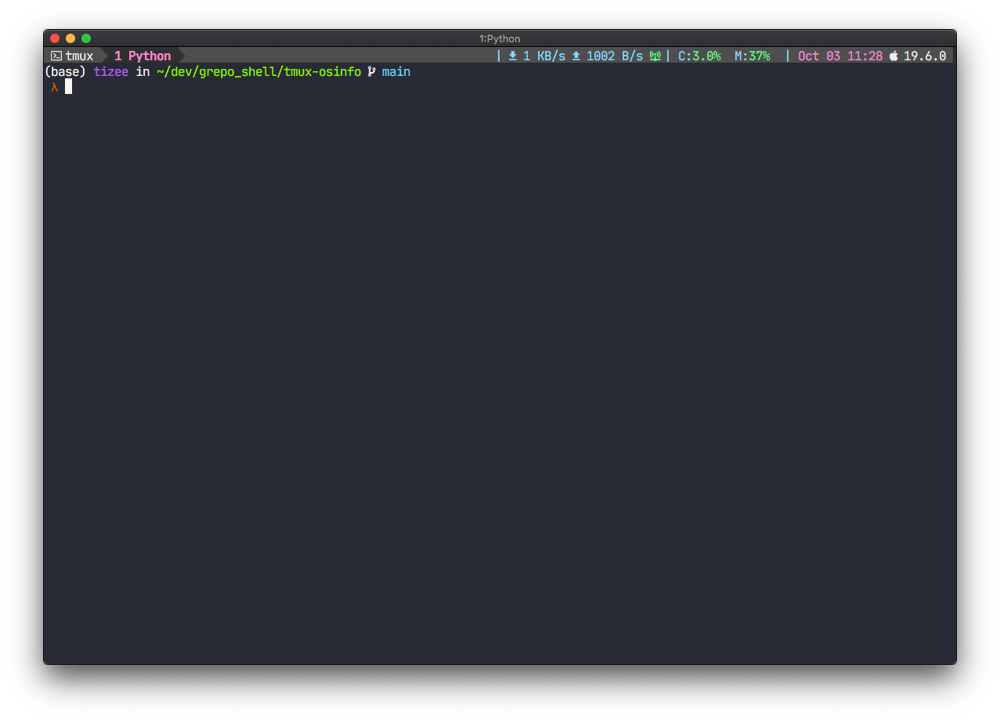

<div align="center">

<h1>tmux-osinfo</h1>

<br/>

<div>

Display System info using `uname`

## Requirements

- Nerd Fonts for displaying system icons
- `uname`

## Support OS

- MacOS
- Linux

## Installation

### TPM

```
set -g @plugin 'tizee/tmux-osinfo'
```

### Manual

```
git clone https://github.com/tizee/tmux-osinfo
```

Put following in your `.tmux.conf`

```
run-shell /path/to/the/tmux-osinfo/tmux-osinfo.tmux
```

Source your `.tmux.conf`

```
tumx source ~/.tmux.conf
```

## Usage

Example:

```
set -g status-right "#{opsystem_icon} #{opsystem_version}"
```

Use `@custom_opsystem_icon` to define the icon string.

```
set -g @custom_opsystem_icon "🐶"
```
